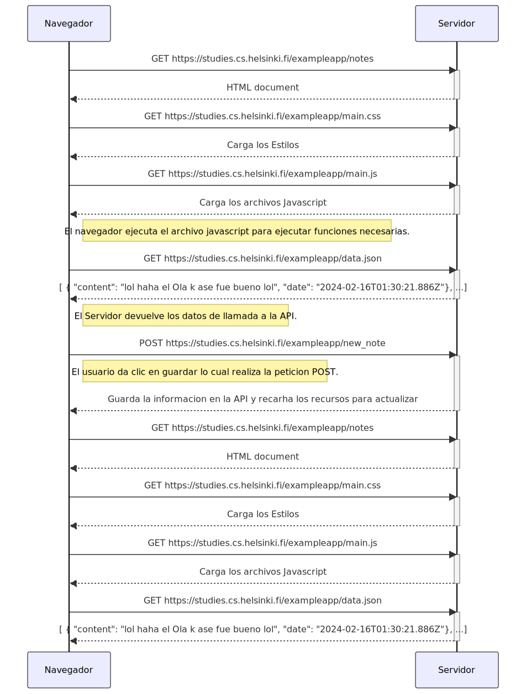
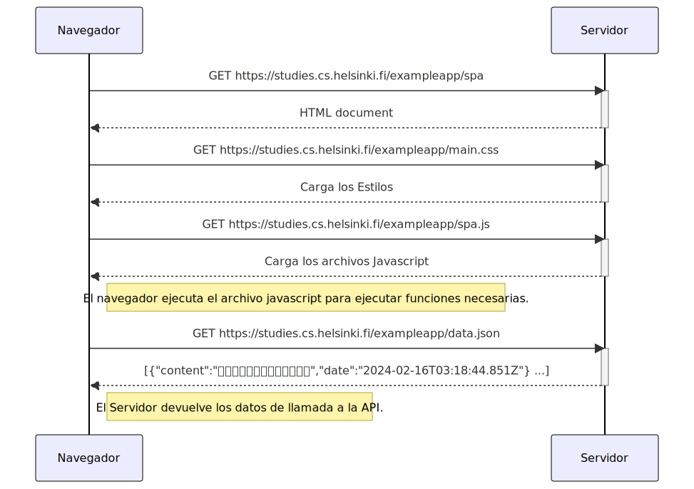
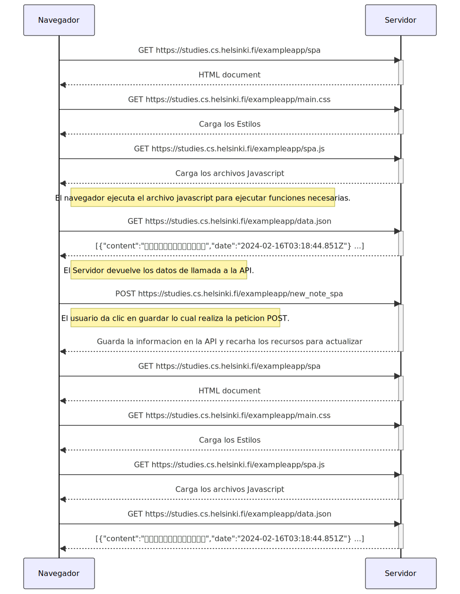

# Fundamentos de las aplicaciones web
 
## Autor

- [@DiegoCedeno12](https://github.com/DiegoCedeno12)

### 0.4 Nuevo Diagrama de Nota
#### Formato de Mermaid

```
sequenceDiagram
    participant Navegador
    participant Servidor

    Navegador->>Servidor: GET https://studies.cs.helsinki.fi/exampleapp/notes
    activate Servidor
    Servidor-->>Navegador: HTML document
    deactivate Servidor

    Navegador->>Servidor: GET https://studies.cs.helsinki.fi/exampleapp/main.css
    activate Servidor
    Servidor-->>Navegador: Carga los Estilos
    deactivate Servidor

    Navegador->>Servidor: GET https://studies.cs.helsinki.fi/exampleapp/main.js
    activate Servidor
    Servidor-->>Navegador: Carga los archivos Javascript
    deactivate Servidor

    Note right of Navegador: El navegador ejecuta el archivo javascript para ejecutar funciones necesarias.

    Navegador->>Servidor: GET https://studies.cs.helsinki.fi/exampleapp/data.json
    activate Servidor
    Servidor-->>Navegador: [ { "content": "lol haha el Ola k ase fue bueno lol", "date": "2024-02-16T01:30:21.886Z"}, ...]
    deactivate Servidor

    Note right of Navegador: El Servidor devuelve los datos de llamada a la API.

    Navegador->>Servidor: POST https://studies.cs.helsinki.fi/exampleapp/new_note
    activate Servidor
    Note right of Navegador: El usuario da clic en guardar lo cual realiza la peticion POST.
    Servidor-->>Navegador: Guarda la informacion en la API y recarha los recursos para actualizar
    deactivate Servidor

    Navegador->>Servidor: GET https://studies.cs.helsinki.fi/exampleapp/notes
    activate Servidor
    Servidor-->>Navegador: HTML document
    deactivate Servidor

    Navegador->>Servidor: GET https://studies.cs.helsinki.fi/exampleapp/main.css
    activate Servidor
    Servidor-->>Navegador: Carga los Estilos
    deactivate Servidor

    Navegador->>Servidor: GET https://studies.cs.helsinki.fi/exampleapp/main.js
    activate Servidor
    Servidor-->>Navegador: Carga los archivos Javascript
    deactivate Servidor

    Navegador->>Servidor: GET https://studies.cs.helsinki.fi/exampleapp/data.json
    activate Servidor
    Servidor-->>Navegador: [ { "content": "lol haha el Ola k ase fue bueno lol", "date": "2024-02-16T01:30:21.886Z"}, ...]
    deactivate Servidor

```
## Screenshots




### 0.5 Nuevo Diagrama de Nota
#### Formato de Mermaid

```javascript
sequenceDiagram
    participant Navegador
    participant Servidor

    Navegador->>Servidor: GET https://studies.cs.helsinki.fi/exampleapp/spa
    activate Servidor
    Servidor-->>Navegador: HTML document
    deactivate Servidor

    Navegador->>Servidor: GET https://studies.cs.helsinki.fi/exampleapp/main.css
    activate Servidor
    Servidor-->>Navegador: Carga los Estilos
    deactivate Servidor

    Navegador->>Servidor: GET https://studies.cs.helsinki.fi/exampleapp/spa.js
    activate Servidor
    Servidor-->>Navegador: Carga los archivos Javascript
    deactivate Servidor

    Note right of Navegador: El navegador ejecuta el archivo javascript para ejecutar funciones necesarias.

    Navegador->>Servidor: GET https://studies.cs.helsinki.fi/exampleapp/data.json
    activate Servidor
    Servidor-->>Navegador: [{"content":"🥰🥰🥰🥰🥰🥰🥰🥰🥰🥰🥰🥰🥰","date":"2024-02-16T03:18:44.851Z"} ...]
    deactivate Servidor

    Note right of Navegador: El Servidor devuelve los datos de llamada a la API.

```
## Screenshots




### 0.6 Nuevo Diagrama de Nota

```
sequenceDiagram
    participant Navegador
    participant Servidor

    Navegador->>Servidor: GET https://studies.cs.helsinki.fi/exampleapp/spa
    activate Servidor
    Servidor-->>Navegador: HTML document
    deactivate Servidor

    Navegador->>Servidor: GET https://studies.cs.helsinki.fi/exampleapp/main.css
    activate Servidor
    Servidor-->>Navegador: Carga los Estilos
    deactivate Servidor

    Navegador->>Servidor: GET https://studies.cs.helsinki.fi/exampleapp/spa.js
    activate Servidor
    Servidor-->>Navegador: Carga los archivos Javascript
    deactivate Servidor

    Note right of Navegador: El navegador ejecuta el archivo javascript para ejecutar funciones necesarias.

    Navegador->>Servidor: GET https://studies.cs.helsinki.fi/exampleapp/data.json
    activate Servidor
    Servidor-->>Navegador: [{"content":"🥰🥰🥰🥰🥰🥰🥰🥰🥰🥰🥰🥰🥰","date":"2024-02-16T03:18:44.851Z"} ...]
    deactivate Servidor

    Note right of Navegador: El Servidor devuelve los datos de llamada a la API.

    Navegador->>Servidor: POST https://studies.cs.helsinki.fi/exampleapp/new_note
    activate Servidor
    Note right of Navegador: El usuario da clic en guardar lo cual realiza la peticion POST.
    Servidor-->>Navegador: Guarda la informacion en la API y recarha los recursos para actualizar
    deactivate Servidor

    Navegador->>Servidor: GET https://studies.cs.helsinki.fi/exampleapp/spa
    activate Servidor
    Servidor-->>Navegador: HTML document
    deactivate Servidor

    Navegador->>Servidor: GET https://studies.cs.helsinki.fi/exampleapp/main.css
    activate Servidor
    Servidor-->>Navegador: Carga los Estilos
    deactivate Servidor

    Navegador->>Servidor: GET https://studies.cs.helsinki.fi/exampleapp/spa.js
    activate Servidor
    Servidor-->>Navegador: Carga los archivos Javascript
    deactivate Servidor

    Navegador->>Servidor: GET https://studies.cs.helsinki.fi/exampleapp/data.json
    activate Servidor
    Servidor-->>Navegador: [{"content":"🥰🥰🥰🥰🥰🥰🥰🥰🥰🥰🥰🥰🥰","date":"2024-02-16T03:18:44.851Z"} ...]
    deactivate Servidor
```
## Screenshots


