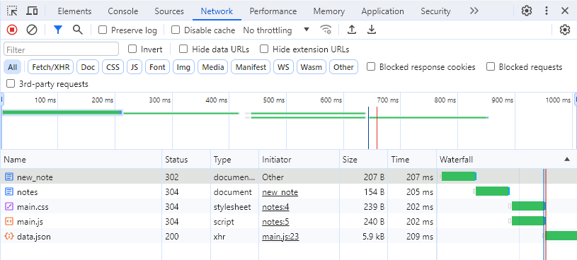
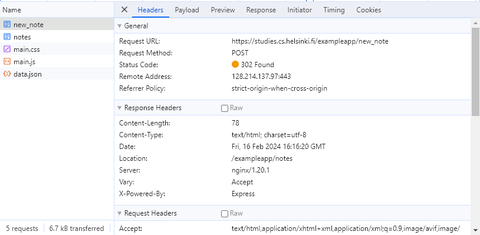
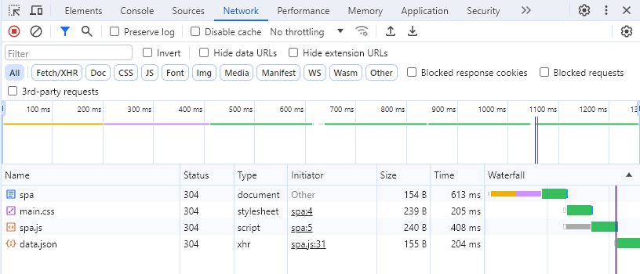
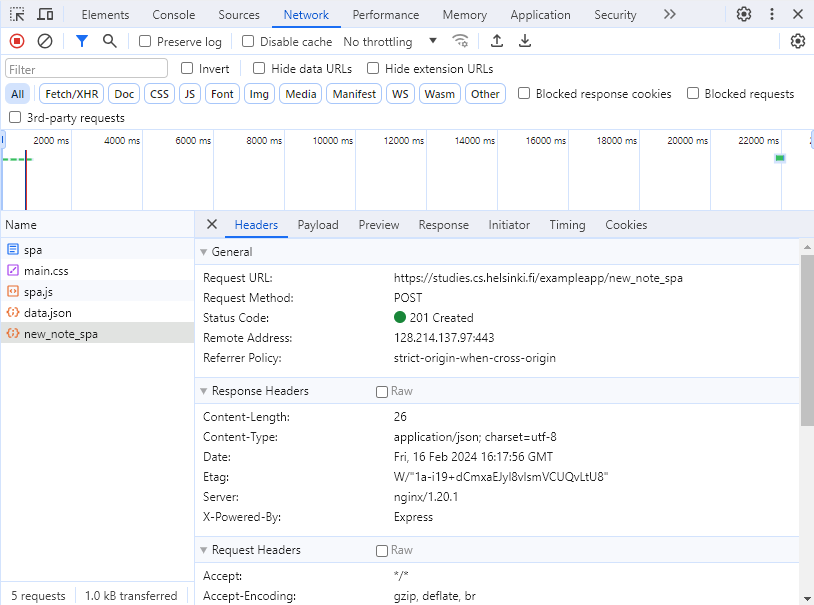
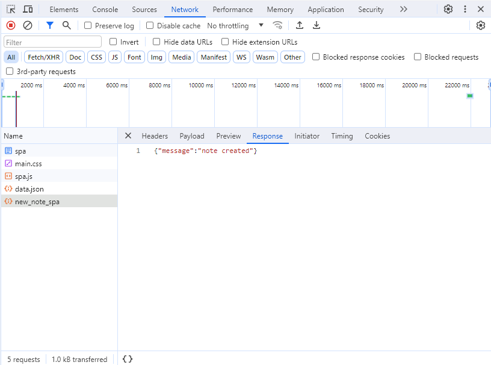

# Fundamentos de las aplicaciones web
 
## Autor

- [@DiegoCedeno12](https://github.com/DiegoCedeno12)

### 0.4 Nuevo Diagrama de Nota
#### Formato de Mermaid

```
sequenceDiagram
    participant Navegador
    participant Servidor

    Navegador->>Servidor: GET https://studies.cs.helsinki.fi/exampleapp/notes
    activate Servidor
    Servidor-->>Navegador: HTML document
    deactivate Servidor

    Navegador->>Servidor: GET https://studies.cs.helsinki.fi/exampleapp/main.css
    activate Servidor
    Servidor-->>Navegador: Carga los Estilos
    deactivate Servidor

    Navegador->>Servidor: GET https://studies.cs.helsinki.fi/exampleapp/main.js
    activate Servidor
    Servidor-->>Navegador: Carga los archivos Javascript
    deactivate Servidor

    Note right of Navegador: El navegador ejecuta el archivo javascript para ejecutar funciones necesarias.

    Navegador->>Servidor: GET https://studies.cs.helsinki.fi/exampleapp/data.json
    activate Servidor
    Servidor-->>Navegador: [ { "content": "lol haha el Ola k ase fue bueno lol", "date": "2024-02-16T01:30:21.886Z"}, ...]
    deactivate Servidor

    Note right of Navegador: El Servidor devuelve los datos de llamada a la API.

    Navegador->>Servidor: POST https://studies.cs.helsinki.fi/exampleapp/new_note
    activate Servidor
    Note right of Navegador: El usuario da clic en guardar lo cual realiza la peticion POST.
    Servidor-->>Navegador: Guarda la informacion en la API y recarha los recursos para actualizar
    deactivate Servidor

    Navegador->>Servidor: GET https://studies.cs.helsinki.fi/exampleapp/notes
    activate Servidor
    Servidor-->>Navegador: HTML document
    deactivate Servidor

    Navegador->>Servidor: GET https://studies.cs.helsinki.fi/exampleapp/main.css
    activate Servidor
    Servidor-->>Navegador: Carga los Estilos
    deactivate Servidor

    Navegador->>Servidor: GET https://studies.cs.helsinki.fi/exampleapp/main.js
    activate Servidor
    Servidor-->>Navegador: Carga los archivos Javascript
    deactivate Servidor

    Navegador->>Servidor: GET https://studies.cs.helsinki.fi/exampleapp/data.json
    activate Servidor
    Servidor-->>Navegador: [ { "content": "lol haha el Ola k ase fue bueno lol", "date": "2024-02-16T01:30:21.886Z"}, ...]
    deactivate Servidor

```
#### Screenshots


Como podemos observar al cliente/usuario al guardar una nueva nota se realiza una nueva peticion al servidor esta vez de tipo POST el cual si lo vemos en el navegados se muestra se la siguiente manera



Ademas tambien podemos observar que una vez que el servidor guarda la respuesta nos da una respuesta que la podemos ver en "response"



### 0.5 Nuevo Diagrama de Nota
#### Formato de Mermaid

```javascript
sequenceDiagram
    participant Navegador
    participant Servidor

    Navegador->>Servidor: GET https://studies.cs.helsinki.fi/exampleapp/spa
    activate Servidor
    Servidor-->>Navegador: HTML document
    deactivate Servidor

    Navegador->>Servidor: GET https://studies.cs.helsinki.fi/exampleapp/main.css
    activate Servidor
    Servidor-->>Navegador: Carga los Estilos
    deactivate Servidor

    Navegador->>Servidor: GET https://studies.cs.helsinki.fi/exampleapp/spa.js
    activate Servidor
    Servidor-->>Navegador: Carga los archivos Javascript
    deactivate Servidor

    Note right of Navegador: El navegador ejecuta el archivo javascript para ejecutar funciones necesarias.

    Navegador->>Servidor: GET https://studies.cs.helsinki.fi/exampleapp/data.json
    activate Servidor
    Servidor-->>Navegador: [{"content":"🥰🥰🥰🥰🥰🥰🥰🥰🥰🥰🥰🥰🥰","date":"2024-02-16T03:18:44.851Z"} ...]
    deactivate Servidor

    Note right of Navegador: El Servidor devuelve los datos de llamada a la API.

```
#### Screenshots


Como podemos observar al cliente/usuario al ingresar a la pagina se nos cargan los siguientes recursos iniciando con el html para mostrar el contenido, luego el css, posteriormente los archivos javascript para ejecutar funciones u operaciones que sean necesarias y se realiza la peticion get al servidor para obtener los datos en un formato json que se muestra al final




### 0.6 Nuevo Diagrama de Nota

```
sequenceDiagram
    participant Navegador
    participant Servidor

    Navegador->>Servidor: GET https://studies.cs.helsinki.fi/exampleapp/spa
    activate Servidor
    Servidor-->>Navegador: HTML document
    deactivate Servidor

    Navegador->>Servidor: GET https://studies.cs.helsinki.fi/exampleapp/main.css
    activate Servidor
    Servidor-->>Navegador: Carga los Estilos
    deactivate Servidor

    Navegador->>Servidor: GET https://studies.cs.helsinki.fi/exampleapp/spa.js
    activate Servidor
    Servidor-->>Navegador: Carga los archivos Javascript
    deactivate Servidor

    Note right of Navegador: El navegador ejecuta el archivo javascript para ejecutar funciones necesarias.

    Navegador->>Servidor: GET https://studies.cs.helsinki.fi/exampleapp/data.json
    activate Servidor
    Servidor-->>Navegador: [{"content":"🥰🥰🥰🥰🥰🥰🥰🥰🥰🥰🥰🥰🥰","date":"2024-02-16T03:18:44.851Z"} ...]
    deactivate Servidor

    Note right of Navegador: El Servidor devuelve los datos de llamada a la API.

    Navegador->>Servidor: POST https://studies.cs.helsinki.fi/exampleapp/new_note
    activate Servidor
    Note right of Navegador: El usuario da clic en guardar lo cual realiza la peticion POST.
    Servidor-->>Navegador: Guarda la informacion en la API y recarha los recursos para actualizar
    deactivate Servidor

    Navegador->>Servidor: GET https://studies.cs.helsinki.fi/exampleapp/spa
    activate Servidor
    Servidor-->>Navegador: HTML document
    deactivate Servidor

    Navegador->>Servidor: GET https://studies.cs.helsinki.fi/exampleapp/main.css
    activate Servidor
    Servidor-->>Navegador: Carga los Estilos
    deactivate Servidor

    Navegador->>Servidor: GET https://studies.cs.helsinki.fi/exampleapp/spa.js
    activate Servidor
    Servidor-->>Navegador: Carga los archivos Javascript
    deactivate Servidor

    Navegador->>Servidor: GET https://studies.cs.helsinki.fi/exampleapp/data.json
    activate Servidor
    Servidor-->>Navegador: [{"content":"🥰🥰🥰🥰🥰🥰🥰🥰🥰🥰🥰🥰🥰","date":"2024-02-16T03:18:44.851Z"} ...]
    deactivate Servidor
```
#### Screenshots


Como podemos observar el cliente/usuario al guardar una nueva nota se realiza una nueva peticion al servidor esta vez de tipo POST el cual si lo vemos en el navegados se muestra se la siguiente manera



Ademas tambien podemos observar que una vez que el servidor guarda la respuesta nos da una respuesta que la podemos ver en "response" de que la nota fue creada

